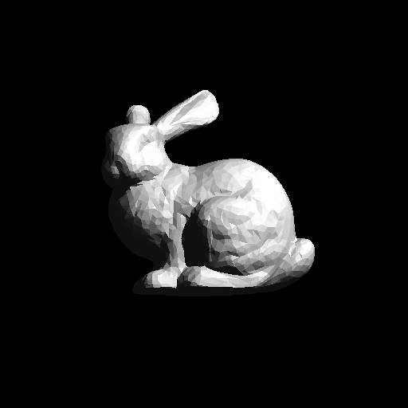
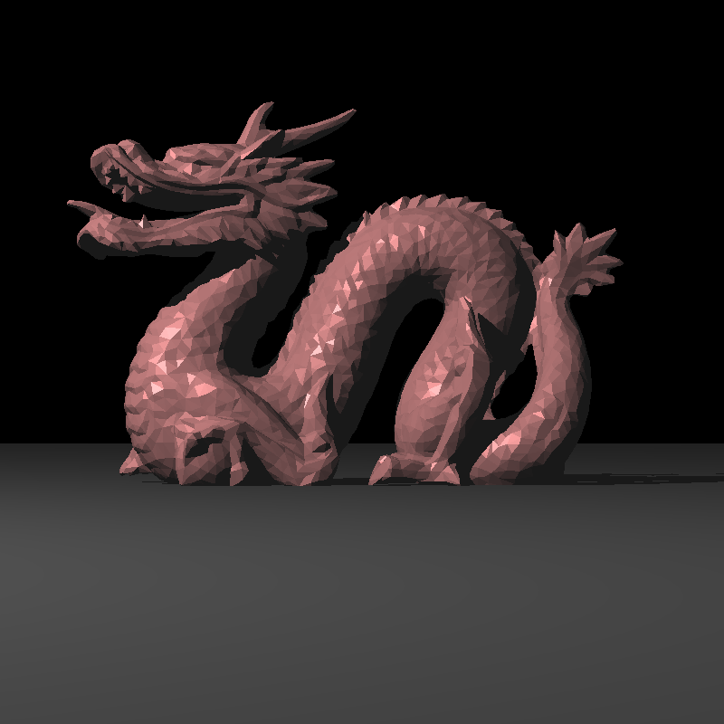
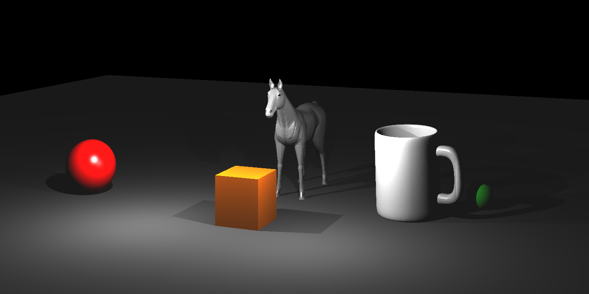

# RayTracing

A basic ray tracer that simulates the propagation of light in the real world.

# To run 
```shell
$ make 
$ ./raytracer Sample_scenes/<filename>.xml <outputfilename>.ppm
```
# Example Results
Bunny (512x512)



Dragon (800x800)


Horse and Mug (1440x720)

